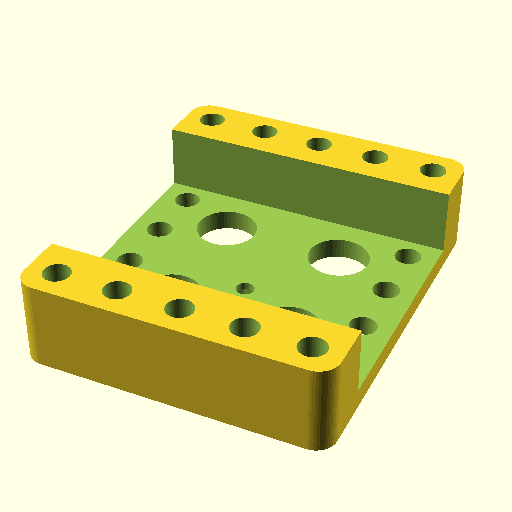

# OOMP Electrical Extension Lead UK Socket 6 Outlet Pro Elec 2068 Version 5

This repository defines an OOMP/OOBB part entry for a `Pro Elec 2068` UK 6-outlet extension lead and generate a matching OOBB holder model plus metadata and printable outputs.



## What It Does

- Stores source metadata for the extension lead in `parts_source/`.
- Populates OOMP-style part data into `parts/`.
- Builds OpenSCAD output for an OOBB holder sized `5 x 6 x 21`.
- Optionally generates STL files and navigation output for the OOBB catalog tree.

The generated holder output in this repo is under `parts/oobb_holder_5_width_6_height_21_depth_electrical_extension_lead_uk_socket_6_outlet_pro_elec_2068/`.

## Repository Structure

```text
action_make_all.py                         Full run helper; enables STL generation
working.py                                 Main orchestration entry point
working_oomp_populate.py                   Builds source extras/taxonomy data
working_oomp.py                            Loads `parts_source/` and writes OOMP part data
working_scad.py                            Loads part YAML and builds SCAD/navigation output
parts_source/                              Hand-authored source metadata and reference files
parts/                                     Generated part data and model outputs
navigation_oobb/                           Generated navigation-friendly OOBB outputs
source_file/                               Reference diagram/data sheet files
```

## Usage

All of the files used to create the generated assets are present in this repository, but it is fairly higgly piggly rather than set up as a polished standalone tool.

For most people, the practical use of this repo is to download the checked-in assets, especially:

- `parts/.../3dpr.stl`
- `parts/.../3dpr.scad`
- `parts/.../3dpr.png`
- `source_file/..._datasheet.pdf`

It also exists on GitHub so it can be used as part of larger OOMP catalogue aggregation and generation projects.

## Important Files

- `parts_source/electrical_extension_lead_uk_socket_6_outlet_pro_elec_2068/working.yaml`  
  Source taxonomy and product reference URL.
- `parts_source/oobb_holder_5_width_6_height_21_depth_electrical_extension_lead_uk_socket_6_outlet_pro_elec_2068/working.yaml`  
  Holder dimensions and OOBB metadata.
- `parts/oobb_holder_5_width_6_height_21_depth_electrical_extension_lead_uk_socket_6_outlet_pro_elec_2068/3dpr.scad`  
  Generated OpenSCAD model.
- `parts/oobb_holder_5_width_6_height_21_depth_electrical_extension_lead_uk_socket_6_outlet_pro_elec_2068/3dpr.stl`  
  Generated printable mesh.
- `source_file/electrical_extension_lead_uk_socket_6_outlet_pro_elec_2068_datasheet.pdf`  
  Referenced product datasheet.

## Dependencies / Related Repos

- `oomlout_oobb_version_5` appears to provide OOBB geometry helpers used by `working_scad.py`.
- `oomlout_oomp_version_5` appears to provide OOMP metadata/population helpers used by `working_oomp.py` and `working_oomp_populate.py`.
- `oomlout_roboclick` is imported directly by `working_oomp.py`.

## Dependency Notes

`requirements.txt` only includes the clearly identifiable external package from this repository's imports: `PyYAML`.

The remaining imported modules do not appear to be standard-library modules, but from this repository alone it is unclear whether they are installed from PyPI, from editable sibling repos, or from a shared local toolchain. For that reason, they are documented here rather than guessed into `requirements.txt`.

## Notes

- The checked-in outputs suggest this repository is both a source repo and a generated-artifact repo.
- The holder model appears sized for an OOBB `holder` with `width: 5`, `height: 6`, and `thickness: 21`.
- No license file was found in this repository.

This README was AI-generated and mildly edited.
